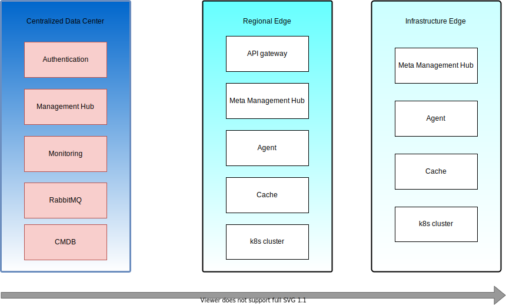

# EMP (Edge Management Platform)

# Introduction
  Edge Management Platform 可以用于 Edge 站点的集群生命周期管理以及应用部署。Edge 与
中心云之间的交互采用适用网络环境较差的 MQTT 协议。

# Architecture

 平台架构设计包含三级, 参考 Linux 基金会对 Edge 定义的场景，分别是：
 - Centralized Data center 也叫中心云，用于管理和监控所有的 Edge 
站点。
 - Regional Edge 区域 Edge 站点: 作为区域的 Edge 管理，以及区域 Edge site 管理服务的入口。
 - Infrastructure Edge 边缘的 Edge 站点： 作为实际运行 workloads 的站点，与 Edge Devices
进行交换。运行 Edge 的工作流。

# Components
由于 平台组件会分布在三级站点，所有根据组件所在位置，可以进行如下划分：
- Centralized Data center:
    - authentication
    - Management Job
    - Monitoring
    - RabbitMQ
    - CMDB

- Region Edge:
    - Edge Api gateway
    - Meta Management Hub
    - Edge agent
    - Cache

- Infrastructure Edge
    - Meta Management Hub
    - Agent
    - Cache
    
# Todo List
- [ ] CMDB
- [ ] Management Hub
- [ ] Agent
- [ ] Meta Management Hub
- [ ] Cache
- [ ] API Gateway 
